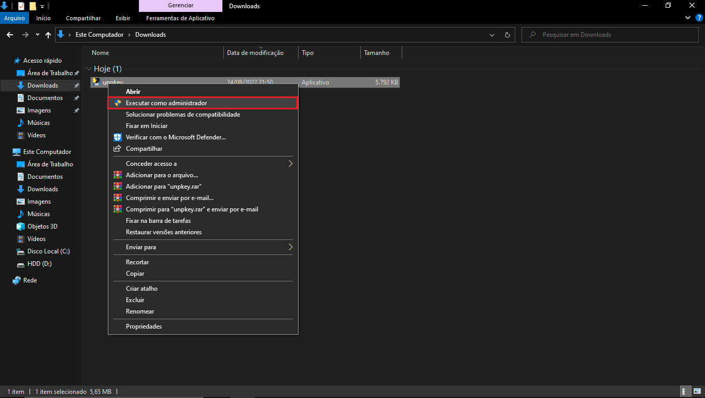

# unpkey

Está ferramenta pode ser utilizada para desinstalar as chaves do Office

-----Instruções para o uso-----  
  
1_Fazer o download do arquivo "unpkey.exe" na pasta unpkey > dist deste repositório  
2_Clicar com o botão direito em cima do arquivo .exe baixado e selecionar "Executar como administrador"  
  
  
3_Clicar em "Mais informações"  
  
  
4_Clicar em "Executar mesmo assim"  
  
  
5_Clicar em "Sim" na mensagem pedindo a autorização do administrador  
6_Aguardar o término da desinstalações das chaves e apertar qualquer botão para finalizar
